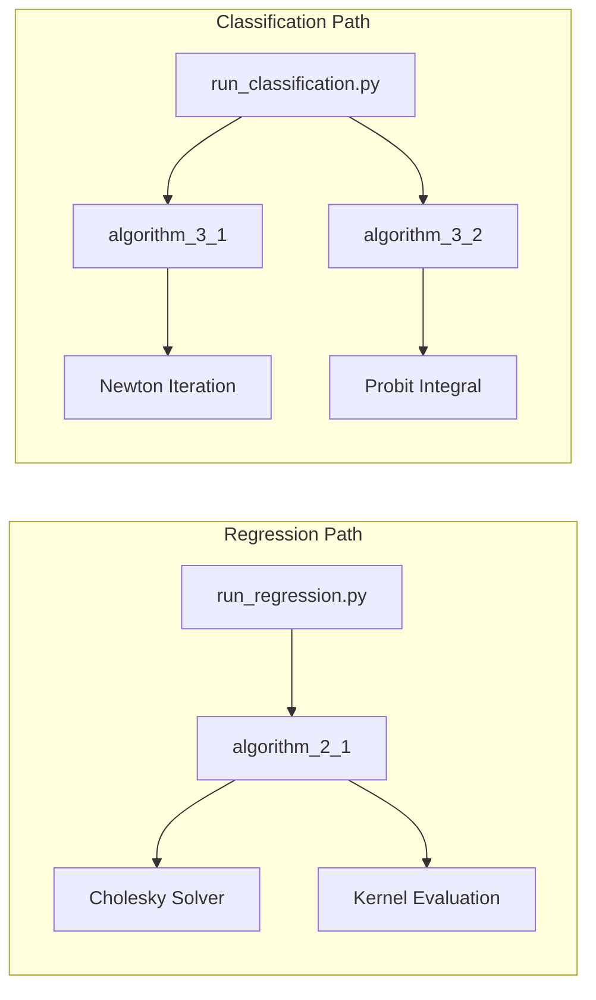
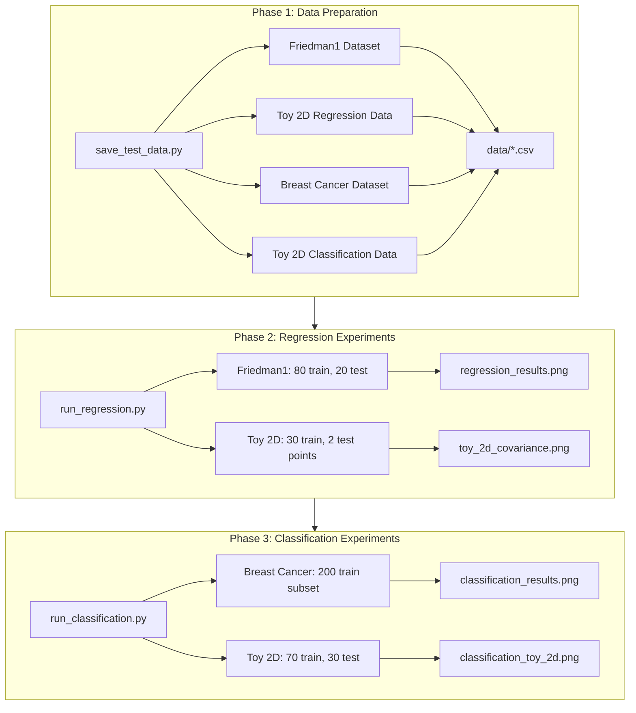

# Implementation and Analysis of Gaussian Process Algorithms for Regression and Binary Classification

A rigorous implementation of Gaussian Process (GP) algorithms from Rasmussen and Williams (2006), implementing Algorithm 2.1 for regression and Algorithms 3.1 and 3.2 for binary classification. This project provides numerically stable implementations with Cholesky decomposition, Laplace approximation, and Newton-based mode-finding.

---

## Table of Contents

- [Overview](#overview)
- [System Architecture](#system-architecture)
- [Algorithm Design](#algorithm-design)
- [Data Pipeline](#data-pipeline)
- [Project Structure](#project-structure)
- [Installation](#installation)
- [Execution Workflow](#execution-workflow)
- [Output Specifications](#output-specifications)
- [References](#references)

---

## Overview

This repository implements three core algorithms from *Gaussian Processes for Machine Learning* (Rasmussen and Williams, 2006):

| Algorithm | Description | Computational Complexity |
|-----------|-------------|--------------------------|
| Algorithm 2.1 | GP regression: predictive mean, variance, log marginal likelihood | O(n³) Cholesky, O(n²) per test point |
| Algorithm 3.1 | Laplace GPC: posterior mode via Newton's method | O(n³) per Newton iteration |
| Algorithm 3.2 | Laplace GPC: averaged predictive class probability | O(n³) once, O(n²) per test point |

The implementation uses the squared exponential (RBF) kernel and employs Cholesky decomposition for numerical stability. Classification uses the probit likelihood for analytic predictive probabilities.

---

## System Architecture

### High-Level Architecture

```mermaid
flowchart TB
    subgraph InputLayer["Input Layer"]
        A[Training Data X, y]
        B[Test Inputs x*]
        C[Hyperparameters]
    end

    subgraph CoreModules["Core Modules"]
        D[gp_regression.py]
        E[gp_classification.py]
    end

    subgraph KernelLayer["Kernel Layer"]
        F[Squared Exponential Kernel]
    end

    subgraph OutputLayer["Output Layer"]
        G[Predictive Mean f*]
        H[Predictive Variance V[f*]]
        I[Class Probability π̄*]
        J[Log Marginal Likelihood]
    end

    A --> D
    A --> E
    B --> D
    B --> E
    C --> D
    C --> E
    F --> D
    F --> E
    D --> G
    D --> H
    D --> J
    E --> I
    E --> H
```

### Component Interaction Diagram



---

## Algorithm Design

### Algorithm 2.1: GP Regression Flow

```mermaid
flowchart TD
    A[Input: X, y, x*, kernel, σₙ] --> B[Compute K = kernel(X, X)]
    B --> C[K_noise = K + σₙ²I + jitter]
    C --> D[L = Cholesky(K_noise)]
    D --> E[α = L⁻¹ᵀ(L⁻¹y)]
    E --> F[k* = kernel(X, x*)]
    F --> G[f̄* = k*ᵀα]
    G --> H[v = L⁻¹k*]
    H --> I[V[f*] = k(x*,x*) - vᵀv]
    I --> J[log p(y|X) = -½yᵀα - Σlog Lᵢᵢ - n/2 log 2π]
    J --> K[Output: f̄*, V[f*], log marginal]
```

### Algorithms 3.1 and 3.2: Binary GP Classification Flow

```mermaid
flowchart TD
    A[Input: X, y, K] --> B[Initialize f = 0]
    B --> C[Compute W = -∇∇log p(y|f)]
    C --> D[B = I + W¹/² K W¹/²]
    D --> E[L = Cholesky(B)]
    E --> F[b = Wf + ∇log p(y|f)]
    F --> G[a = b - W¹/² L⁻¹ᵀ(L⁻¹ W¹/² Kb)]
    G --> H[f_new = Ka]
    H --> I{Converged?}
    I -->|No| B
    I -->|Yes| J[Output: f̂ mode]
    J --> K[For each x*: k* = kernel(X, x*)]
    K --> L[f̄* = k*ᵀ ∇log p(y|f̂)]
    L --> M[v = L⁻¹(W¹/² k*)]
    M --> N[V[f*] = k(x*,x*) - vᵀv]
    N --> O[π̄* = Φ(f̄*/√(1+V[f*]))]
    O --> P[Output: π̄*]
```

### Kernel Function Specification

The squared exponential (RBF) covariance function is defined as:

```
k(x, x') = σ_f² · exp(-||x - x'||² / (2ℓ²))
```

| Parameter | Symbol | Default | Description |
|-----------|--------|---------|-------------|
| Length scale | ℓ | 1.0 | Controls smoothness of the function |
| Signal variance | σ_f | 1.0 | Output scale |
| Noise variance | σ_n | 0.1 | Observation noise (regression only) |

---

## Data Pipeline

### End-to-End Execution Flow



### Dataset Specifications

| Dataset | Source | Train/Test | Features | Purpose |
|---------|--------|------------|----------|---------|
| Friedman1 | scikit-learn | 80/20 | 5 | Regression evaluation |
| Toy 2D Regression | Synthetic | 30/2 | 2 | Covariance visualization |
| Breast Cancer | scikit-learn | 200/171 | 30 | Binary classification |
| Toy 2D Classification | make_blobs | 70/30 | 2 | Decision boundary visualization |

---

## Project Structure

```
.
├── gp_regression.py           # Algorithm 2.1: Cholesky-based predictive distribution
├── gp_classification.py      # Algorithms 3.1, 3.2: Laplace approximation, Newton mode-finding
├── run_regression.py         # Regression experiments and 2D covariance visualization
├── run_classification.py     # Classification experiments and uncertainty analysis
├── run_all.py                # Orchestrates regression and classification experiments
├── save_test_data.py         # Generates train/test splits to data/
├── report.pdf                # Compiled report (submission document)
├── requirements.txt          # Python dependencies
├── data/                     # Generated CSV files (run save_test_data.py)
│   ├── regression_train_X.csv
│   ├── regression_train_y.csv
│   ├── regression_test_X.csv
│   ├── regression_test_y.csv
│   ├── toy_2d_train_X.csv
│   ├── toy_2d_train_y.csv
│   ├── toy_2d_test_X.csv
│   ├── classification_train_X.csv
│   ├── classification_train_y.csv
│   ├── classification_test_X.csv
│   └── classification_test_y.csv
├── regression_results.png    # Friedman1 predictions and uncertainty bands
├── toy_2d_covariance.png     # 2D posterior mean, covariance matrix, cov(f,f')
├── classification_results.png # Calibration, uncertainty analysis, PCA projection
└── classification_toy_2d.png # 2D decision boundary and uncertainty map
```

---

## Installation

**Requirements:** Python 3.7 or higher

```bash
pip install -r requirements.txt
```

Dependencies: `numpy`, `matplotlib`, `scikit-learn`, `scipy`

---

## Execution Workflow

### Step 1: Data Preparation

Generates train/test splits and writes CSV files to `data/`. Required for reproducibility and submission.

```bash
python3 save_test_data.py
```

**Output:** `data/regression_*.csv`, `data/toy_2d_*.csv`, `data/classification_*.csv`

### Step 2: Regression Experiments

Executes Algorithm 2.1 on Friedman1 and the toy 2D dataset. Computes predictive mean, variance, and log marginal likelihood for each test point.

```bash
python3 run_regression.py
```

**Output:** `regression_results.png`, `toy_2d_covariance.png`

### Step 3: Classification Experiments

Executes Algorithms 3.1 and 3.2 on breast cancer and toy 2D datasets. Uses Newton's method for posterior mode, probit likelihood for averaged predictive probability.

```bash
python3 run_classification.py
```

**Output:** `classification_results.png`, `classification_toy_2d.png`

### Consolidated Execution

Runs regression and classification experiments sequentially (does not execute data preparation).

```bash
python3 run_all.py
```

---

## Output Specifications

| File | Content |
|------|---------|
| `regression_results.png` | Left: Predicted vs actual scatter. Right: Predictions with ±2σ uncertainty bands. |
| `toy_2d_covariance.png` | (a) Posterior mean surface; (b) 2×2 predictive covariance heatmap; (c) Posterior covariance along a line. |
| `classification_results.png` | (a) Predictions colored by latent variance; (b) Calibration curve; (c) Uncertainty vs distance from boundary; (d) 2D PCA projection. |
| `classification_toy_2d.png` | Left: Predictive probability π̄(x). Right: Latent variance V[f*] over input space. |

---

## References

- Rasmussen, C. E., and Williams, C. K. I. (2006). *Gaussian Processes for Machine Learning*. MIT Press.
- Williams, C. K. I., and Barber, D. (1998). Bayesian classification with Gaussian processes. *IEEE TPAMI*, 20(12):1342–1351.
- Bishop, C. M. (2006). *Pattern Recognition and Machine Learning*. Springer.
